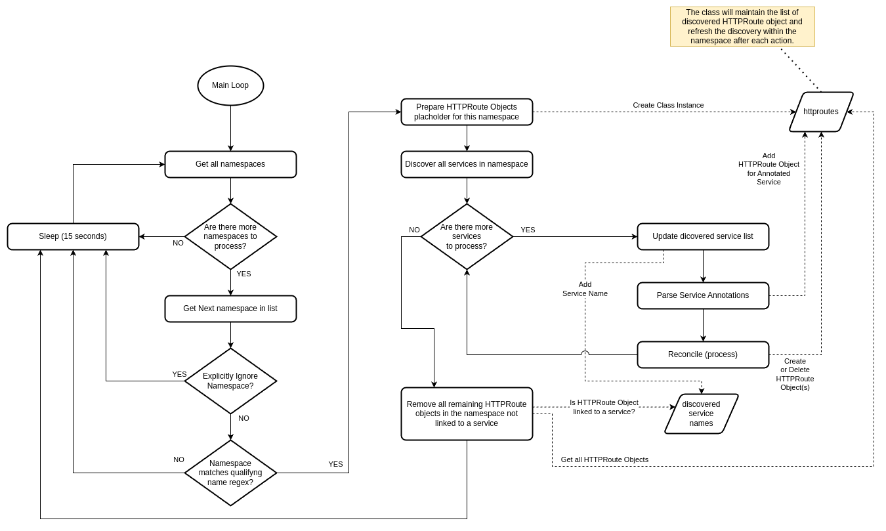

[main](../README.md)

<hr />

# Dynamic Admission Control

This recipe shows an example of an admission webhook implementation in Python. The aim is to dynamically create `HTTPRoute` objects when `Service` objects indicate that they should be exposed publicly. This is useful for local development with a cluster containing the [Gateway API](https://gateway-api.sigs.k8s.io/) implementation for ingress. In this scenario, the ingress is handled dynamically and the development deployment only needs to concern itself with creating `Service` objects and add the required annotations to handle the dynamic management of `HTTPRoute` objects.

<!-- toc -->

- [Prerequisites](#prerequisites)
- [Walk Through of the Python Webhook Implementation](#walk-through-of-the-python-webhook-implementation)
  * [Validation](#validation)
  * [Mutation](#mutation)
- [The HTTPRoute Controller](#the-httproute-controller)
  * [Basic Processing Logic](#basic-processing-logic)
  * [Various Templates based on Annotations](#various-templates-based-on-annotations)
- [Preparing the Certificates for the Webhook Applications](#preparing-the-certificates-for-the-webhook-applications)
- [Deployment of the Web Hooks](#deployment-of-the-web-hooks)
- [Looking at various test scenarios](#looking-at-various-test-scenarios)
  * [Testing the validating webhook](#testing-the-validating-webhook)
  * [Testing the mutating webhook](#testing-the-mutating-webhook)
    + [Testing Use Case: Creating the service annotations at a later stage (useful for existing deployments)](#testing-use-case-creating-the-service-annotations-at-a-later-stage-useful-for-existing-deployments)
- [References & Links](#references--links)

<!-- tocstop -->

## Prerequisites

These recipes were testing on a `K3s` cluster provisioned according to recipe for running [`k3s` on a Local Development Environment](/bootstrapping/k3s_local_dev/README.md)

The `k3s` Kubernetes distribution already meets all the minimum requirements as set out in the [Kubernetes documentation](https://kubernetes.io/docs/reference/access-authn-authz/extensible-admission-controllers/#prerequisites)

> [!NOTE]
> When you want to use your own images, you will also need access to a trusted and private OCI compliant container registry. [The `Zot` project](https://github.com/project-zot/zot) offers a good solution. By default, the images in the GitHub project registry will be used.

## Walk Through of the Python Webhook Implementation

Keeping with the theme of the local development cluster as described in the prerequisite recipe, this recipe will focus on the following admission web hooks:

- A validating web hook that will ensure that pods targeted for development namespaces meet the minimum requirements
- A mutating web hook that will ensure that pods targeted for development namespaces have proper resource limits set

The annotation on a `Service` object required to allow public access:

```yaml
metadata:
  annotations:
    # Choose EITHER "target-port" or "redirect" - NEVER BOTH. Both supplied
    # will lead to potential routing errors that can be hard to resolve.
    #
    # If neither of these annotations are present, any existing HTTPRoute with
    # a calculated target name will be deleted.
    auto-httproute.<<custom-ref>>.target-port: <<gateway-name>>/<<gateway-namespace>>/<<section-name>>/<<fqdn>>/<<target-srevice-port>>
    auto-httproute.<<custom-ref>>.redirect: <<gateway-name>>/<<gateway-namespace>>/<<section-name>>/<<fqdn>>/<<target-section-name>>
```

### Validation

Validation is applied to the `HTTPRoute` object that is deployed to ensure that it is allowed in the given namespace.

By default, the following namespaces are excluded from the validation checks:

- `argocd`
- `bootstrapping`
- `cert-manager`
- `default`
- `devops`
- `kube-*`
- `nfs`
- `nginx-gateway`
- `tekton-*`

For other namespaces, a naming convention will be applied to determine which namespaces qualify. In this example, namespaces starting with `test-` or `prod-` will be allowed to provision `HTTPRoute` objects as determined by the relevant annotations.

All other namespaces are considered to be development namespaces and will have no `HTTPRoute` objects created.

In these examples, the lists are not configurable, but can be made configurable by reading a file which can be modified by a `ConfigMap`.

### Mutation

When the `Service` is created/updated, and the annotations indicate that the `Service` is public, this hook will also update annotations to reflect the actual values (as needed).

## The HTTPRoute Controller

### Basic Processing Logic

The [controller source file `reconcile.py`](./src/controller_reconcile/reconcile.py) is a single file application that contains all logic.



### Various Templates based on Annotations

The default template for the `HTTPRoute` objects is shown below. By default, HTTP traffic will be routed to HTTPS:

```yaml
---
# HTTP to HTTP Redirect:
---
apiVersion: gateway.networking.k8s.io/v1
kind: HTTPRoute
metadata:
  name: __NAME__
  namespace: __NAMESPACE__
  annotations: __ANNOTATIONS__
spec:
  parentRefs:
  - name: __GATEWAY_NAME__
    namespace: __GATEWAY_NAMESPACE__
    sectionName: __GATEWAY_SECTION_NAME__
  hostnames:
  - __FQDN__
  rules:
  - filters:
    - type: RequestRedirect
      requestRedirect:
        scheme: __GATEWAY_TARGET_SECTION_NAME__
        statusCode: 301
---
# DEFAULT Route:
---
apiVersion: gateway.networking.k8s.io/v1
kind: HTTPRoute
metadata:
  name: __NAME__
  namespace: __NAMESPACE__
  annotations: __ANNOTATIONS__
spec:
  parentRefs:
  - name: __GATEWAY_NAME__
    namespace: __GATEWAY_NAMESPACE__
    sectionName: __GATEWAY_SECTION_NAME__
  hostnames:
  - __FQDN__
  rules:
  - backendRefs:
    - name: __SERVICE_NAME__
      port: __SERVICE_TARGET_PORT__
```

The placeholder to annotation mapping is listed next:

| Placeholder | Annotation Mapping |
|---|---|
| `__NAME__` | The name will be a caluclated value. |
| `__NAMESPACE__` | The target namespace will be the same as where the service is in. |
| `__ANNOTATIONS__` | Annotations that will be added by the reconciliation process. |
| `__GATEWAY_NAME__` | Value of `<<gateway-name>>` |
| `__GATEWAY_NAMESPACE__` | Value of `<<gateway-namespace>>` |
| `__GATEWAY_SECTION_NAME__` | Value of `<<section-name>>` |
| `__FQDN__` | Value of `<<fqdn>>` |
| `__SERVICE_NAME__` | Extracted by the reconciliation discovery |
| `__SERVICE_TARGET_PORT__` | Value of `<<target-service-port>>` |
| `__GATEWAY_TARGET_SECTION_NAME__` | Value of `<<target-section-name>>` |

## Preparing the Certificates for the Webhook Applications

The first step in the [Tekton Pipeline](./tekton/k3s_local_development/01_create_admission_webhook_application_deployment.yaml) is to create the ArgoCD `Application` that will also deploy a `Certificate` taht will trigger `cert-manager` to create the certificate data.

## Deployment of the Web Hooks

In the same [Tekton Pipeline](./tekton/k3s_local_development/01_create_admission_webhook_application_deployment.yaml) that deployed the Helm application, but in a subsequent step, the certificate data will be used and injected in the manifests that will create the `ValidatingWebhookConfiguration` and `MutatingWebhookConfiguration` respectively.

It will take a couple of minutes for the cluster to start using these new web-hooks.

## Looking at various test scenarios

A couple of manifests are included that can be used to exercise the various components. These are included in the `admission_webhooks/test` directory.

> [!WARNING]
> The examples use the domain `example.com` but please be aware that you need to update this to a domain that you own. Also keep in mind that the examples assume a domain managed by AWS Route 53 - some modifications may be required to fit other use cases.

### Testing the validating webhook

The validation webhook reacts to creation or updates to any `HTTProute` object. It will enforce some basic rules to prevent casual deployment and/or updates to these objects outside of the controller.

To test, run the following:

```bash
kubectl apply -f admission_webhooks/test/test_application_nginx_no_annotations_with_httproute.yaml
# namespace/test-app created
# deployment.apps/nginx-deployment created
# service/nginx-service created
# Error from server: error when creating "admission_webhooks/test/test_application_nginx_no_annotations_with_httproute.yaml": admission webhook "auto-httproute-validating-hook.example.com" denied the request: Not allowed by policy [Policy: strict-no-unmanaged-httproutes]
```

As can be seen from the error, the `HTTPRoute` object creation is blocked. In turn, when the manifest is deleted, we will also get an expected error that the `HTTPRoute` object could not be deleted since it was never created in the first place:

```bash
kubectl delete -f admission_webhooks/test/test_application_nginx_no_annotations_with_httproute.yaml
# namespace "test-app" deleted
# deployment.apps "nginx-deployment" deleted
# service "nginx-service" deleted
# Error from server (NotFound): error when deleting "admission_webhooks/test/test_application_nginx_no_annotations_with_httproute.yaml": httproutes.gateway.networking.k8s.io "nginx-httproute" not found
```

### Testing the mutating webhook

#### Testing Use Case: Creating the service annotations at a later stage (useful for existing deployments)

First, deploy a very stock standard deployment:

```bash
kubectl apply -f admission_webhooks/test/test_application_nginx_no_annotations.yaml

kubectl get pods,services,httproutes -n test-app
# NAME                                  READY   STATUS    RESTARTS   AGE
# pod/nginx-deployment-96b9d695-xs7dw   1/1     Running   0          3m58s
# pod/nginx-deployment-96b9d695-zfn67   1/1     Running   0          3m58s
#
# NAME                    TYPE        CLUSTER-IP     EXTERNAL-IP   PORT(S)   AGE
# service/nginx-service   ClusterIP   10.43.50.224   <none>        80/TCP    3m58s
```

Nothing will really happen as this is a simple deployment that include a service.

The actual changes we will apply is highlighted below:

```bash
diff admission_webhooks/test/test_application_nginx_no_annotations.yaml admission_webhooks/test/test_application_nginx_no_annotations_updated.yaml       
# 31a32
# > # Add annotations to expose the service to the Internet
# 36a38,40
# >   annotations:
# >     auto-httproute.1.redirect: private-gateway/nginx-gateway/http/test-app.example.com/https
# >     auto-httproute.2.target-port: private-gateway/nginx-gateway/https/test-app.example.com/80
```

When you apply the updates, nothing spectacular will happen initially, but after a while (typically less than 30 seconds), you will see the `HTTPRoute` objects created:

```bash
kubectl apply -f admission_webhooks/test/test_application_nginx_no_annotations_updated.yaml
# namespace/test-app unchanged
# deployment.apps/nginx-deployment unchanged
# service/nginx-service configured

kubectl get pods,services,httproutes -n test-app
# NAME                                  READY   STATUS    RESTARTS   AGE
# pod/nginx-deployment-96b9d695-xs7dw   1/1     Running   0          5m19s
# pod/nginx-deployment-96b9d695-zfn67   1/1     Running   0          5m19s
#
# NAME                    TYPE        CLUSTER-IP     EXTERNAL-IP   PORT(S)   AGE
# service/nginx-service   ClusterIP   10.43.50.224   <none>        80/TCP    5m19s
#
# NAME                                                                                              HOSTNAMES                 AGE
# httproute.gateway.networking.k8s.io/auto-httproute-35402e480c6c705930fb66da390556d827cc0ab0cd10   ["test-app.example.com"]   30s
# httproute.gateway.networking.k8s.io/auto-httproute-613f480792d03aba6780d9b2fe9a382be4c41dcf81c6   ["test-app.example.com"]   30s
```

Assuming the DNS and everything else was hooked up correctly, you could even test that:

```bash
curl -vvv http://test-app.example.com
# < HTTP/1.1 301 Moved Permanently
# < Server: nginx
# < Date: Sun, 14 Sep 2025 13:24:13 GMT
# < Content-Type: text/html
# < Content-Length: 162
# < Connection: keep-alive
# < Location: https://test-app.example.com/
# < 
# <html>
# <head><title>301 Moved Permanently</title></head>
# <body>
# <center><h1>301 Moved Permanently</h1></center>
# <hr><center>nginx</center>
# </body>
# </html>
# * Connection #0 to host test-app.example.com left intact

curl https://test-app.example.com
# <!DOCTYPE html>
# <html>
# <head>
# <title>Welcome to nginx!</title>
# <style>
# html { color-scheme: light dark; }
# body { width: 35em; margin: 0 auto;
# font-family: Tahoma, Verdana, Arial, sans-serif; }
# </style>
# </head>
# <body>
# <h1>Welcome to nginx!</h1>
# <p>If you see this page, the nginx web server is successfully installed and
# working. Further configuration is required.</p>
#
# <p>For online documentation and support please refer to
# <a href="http://nginx.org/">nginx.org</a>.<br/>
# Commercial support is available at
# <a href="http://nginx.com/">nginx.com</a>.</p>
#
# <p><em>Thank you for using nginx.</em></p>
# </body>
# </html>
```

## References & Links

References:

- [Kubernetes Documentation for Admission Control](https://kubernetes.io/docs/reference/access-authn-authz/admission-controllers/) (using the standard web hooks)
- [Kubernetes Documentation for Dynamic Admission Control](https://kubernetes.io/docs/reference/access-authn-authz/extensible-admission-controllers/) (Basically what this recipe is about - creating custom admission web hooks)
- [Manage Kubernetes Admission Webhook certificates with cert-manager CA Injector and Vault PKI](https://medium.com/trendyol-tech/manage-kubernetes-admission-webhooks-certificates-with-cert-manager-ca-injector-and-vault-pki-281b065e1044) (Medium, last visited 2025-08-18)

Useful tools:

- [`stern`](https://github.com/stern/stern) allows you to tail multiple pods on Kubernetes and multiple containers within the pod. Each result is color coded for quicker debugging.

<hr />

[main](../README.md)
