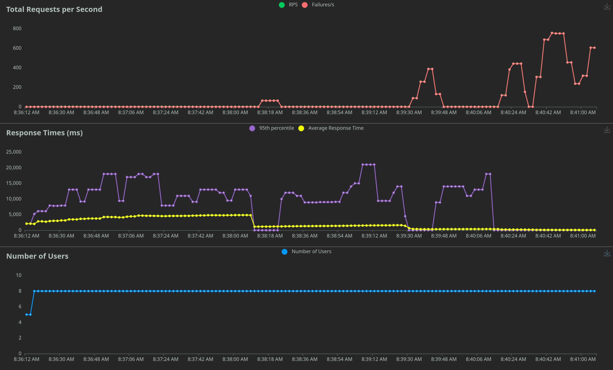
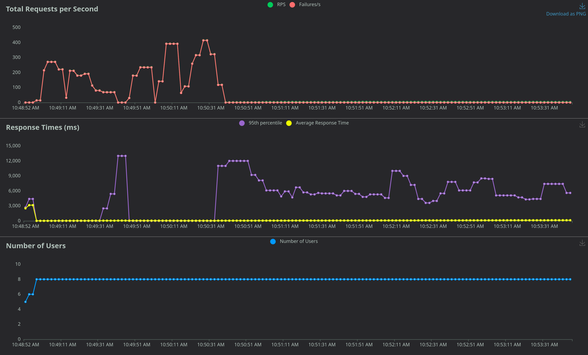

[main index](../../README.md) | back to: [autoscaling topic index](../README.md)

> [!WARNING]
> Work in Progress... This section is still in development and may see various changes from the current state of the content

<!--
TODO - Add metrics monitoring...
-->

# Preparation - Monitor Current Performance

You will need two separate terminal windows for monitoring. Something like [tmux](https://github.com/tmux/tmux/wiki) could help with this by [splitting the window](https://tmuxcheatsheet.com/).

> [!TIP]
> For the experiment, I find it best to have a 3-window spit. First split horisontally with `CTRL+B "`. Then move to the top window and split again vertically with `CTRL+B %`. I use the top two windows for monitoring or watching stuff and the bottom window for entering commands.

In one window, run the following command to get a live view of the nginx ingress:

```shell
# Delete the old Ingress pod in order to get fresh logs
kubectl delete pod $(kubectl get pod -n ingress --output jsonpath='{.items[0].metadata.name}') -n ingress

# Monitor the logs
kubectl logs -f $(kubectl get pod -n ingress --output jsonpath='{.items[0].metadata.name}') -n ingress | ngxtop
```

> [!TIP]
> Wait a couple of minutes for the monitor to settle down. Alternatively delete the ingress Pod to force a fresh new one with empty logs before running the command above.

In the other window, run the following command to monitor the Pod performance: 

```shell
watch kubectl top pod -l name=fastapi-test -n example003
```

> [!NOTE]
> Alternatives to monitor cluster and application performance include:
> 
> * Kubernetes Dashboard, included with [microk8s](https://microk8s.io/docs/addon-dashboard) or [installed separately](https://kubernetes.io/docs/tasks/access-application-cluster/web-ui-dashboard/)
> * Another command line tool, [k9s](https://k9scli.io/)
> * Dedicated monitoring application, for example [kube-prometheus](https://github.com/prometheus-operator/kube-prometheus), which uses Grafana, Prometheus and friends 

# Basic Benchmark

Apply example 3 and start the load test:

```shell
# Deploy the example with no autoscaling
kubectl apply -f autoscaling/horizontal_pod_autoscaling/deployment-no-autoscaling.yaml

# NOTE: Wait about 2 or 3 minutes for the deployment to completely stabilize
sleep 120

# Get the ingress IP
export INGRESS=`kubectl get service ingress -n ingress -o yaml | yq ".status.loadBalancer.ingress[0].ip"`

# Start the load test - The example below starts with 8 users and will run for 5 minutes
locust -f autoscaling/horizontal_pod_autoscaling/loadtest.py \
--host http://$INGRESS \
--users 8 \
--spawn-rate 1 \
--autostart \
--run-time 300
```

In a separate terminal you can open your web browser:

```shell
# Get the ingress IP
xdg-open http://127.0.0.1:8089
```

In some cases using just 1 user should be enough to force a failure, depending on what your host system capabilities are. You can increase the user count if this does not happen. To "shock" the system, start immediately with 8 users.

How will you know there are failures:

* In the locust UI you can observe the error rate
* In a terminal you can verify by doing `curl` requests and monitoring Pod restarts

```shell
# Curl request - working:
$ curl http://$INGRESS/example003  
{"message":"ok"}%

# Failure (at some point)
$ curl http://$INGRESS/example003 
<html>
<head><title>503 Service Temporarily Unavailable</title></head>
<body>
<center><h1>503 Service Temporarily Unavailable</h1></center>
<hr><center>nginx</center>
</body>
</html>

# Observe the pod status (post test, everything stabilized again)
$ kubectl get pods -n example003
NAME                            READY   STATUS    RESTARTS       AGE
fastapi-test-78979f4b8c-bcgct   1/1     Running   6 (119m ago)   124m
fastapi-test-78979f4b8c-cnjvk   1/1     Running   6 (118m ago)   124m
fastapi-test-78979f4b8c-jmw2f   1/1     Running   7 (117m ago)   124m
fastapi-test-78979f4b8c-v8jqb   1/1     Running   6 (118m ago)   124m
```

At the end of the benchmark, you may have a picture similar to the following on your locust web UI:



As can be seen, near the end the Pods just could no longer keep up.

# Add a CPU based Pod Horizontal Autoscaler

Assuming the deployment from the previous test is still deployed, we can easily delete it and deploy our deployment with a CPU based horizontal Pod autoscaling configuration based only on CPU metrics.

```shell
# Delete previous deployment
kubectl delete -f autoscaling/horizontal_pod_autoscaling/deployment-no-autoscaling.yaml

# New deployment, with CPU based horizontal auto scaling
kubectl apply -f autoscaling/horizontal_pod_autoscaling/deployment-cpu-based-autoscaling.yaml

# again, give about 2 minutes for everything to stabilize
sleep 120
```

You can now start the same experiment again, starting with the deletion of the Ingress pod in order to reset the logs.

Kubernetes takes some time to actually start the scaling up of Pods, and since we only start with 2 pods, you may see a high initial failure rate. However, after scaling we see a lot more stable performance eight to the end of the test, as can be seen from the graphs below:



# References

* [Horizontal Pod Autoscaling](https://kubernetes.io/docs/tasks/run-application/horizontal-pod-autoscale/)

<hr />

[main index](../../README.md) | back to: [autoscaling topic index](../README.md)
