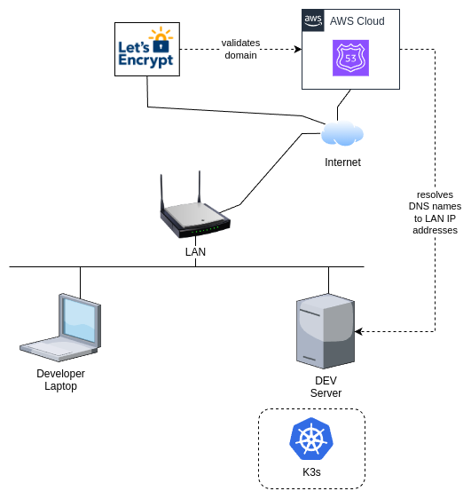
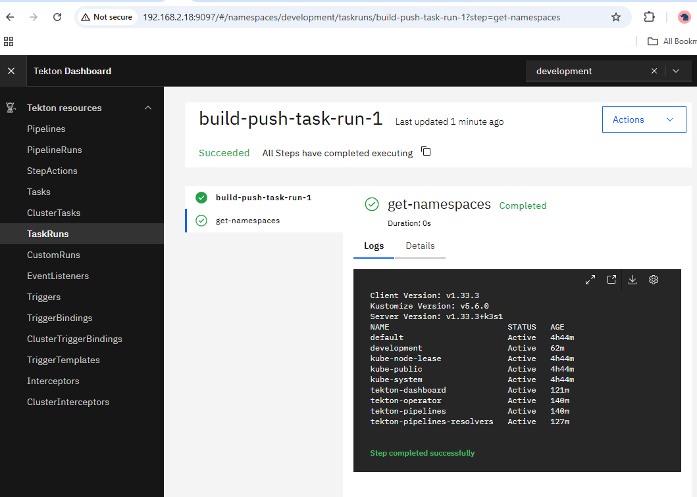

[main index](../../README.md) | [bootstrap menu](../README.md)

<hr />

# Bootstrapping K3s on a Single Host on a Private LAN

> [!INFO]
> The process still needs to be streamlined, and therefore the current documented process may appear more manual than _Infrastructure-as-Code_ for now.

On this page are instructions to setup the following components on a system hosted on a private LAN:

| Component | Use Case |
|---|---|
| `K3s` | Kubernetes Distribution |
| NFS | Persistent storage |
| `cert-manager` | certificate management |
| `Nginx` Gateway Fabric | Ingress |
| `ArgoCD` | Deployment Orchestration |
| `Tekton` | Running pipelines in cluster |
| `Gitea` | In-cluster ArgoCD integration |
| `kube-prometheus` | Observability |
| `Botkube` | Messaging about cluster events in Slack |
| `keptn` | DevOps monitoring|

### Basic Setup

The recipe assumes the following basic setup:



Some variations can be tollerated, notably that the target server and developer laptop may also be one and the same system.

## Component Project Pages and Further Information

| Component | URLs |
|---|---|
| `k3s` | [home](https://k3s.io/) and [GitHub](https://github.com/k3s-io/k3s/) |
| `NFS` Storage Provider | [GitHub](https://github.com/kubernetes-sigs/nfs-subdir-external-provisioner) |
| `cert-manager` | [home](https://cert-manager.io/) and [documentation](https://cert-manager.io/docs/) and [GitHub Repository Index](https://github.com/cert-manager) |
| `Nginx` Gateway Fabrix | [documentation](https://docs.nginx.com/nginx-gateway-fabric/) and [GitHub](https://github.com/nginx/nginx-gateway-fabric) |
| `ArgoCD` | [home](https://argoproj.github.io/cd/) and [documentation](https://argo-cd.readthedocs.io/en/stable/) and [GitHub](https://github.com/argoproj/argo-cd) |
| `Tekton` | [home](https://tekton.dev/) and [documentation](https://tekton.dev/docs/) and [GitHub Repository Index](https://github.com/tektoncd) and [Operator Installation Instruction](https://github.com/tektoncd/operator/blob/main/docs/install.md) |
| `Gitea` | [home](https://about.gitea.com/) and [documentation](https://docs.gitea.com/) |
| `kube-prometheus` | [home](https://prometheus-operator.dev/) and [GitHub](https://github.com/prometheus-operator/kube-prometheus) |
| `BotKube` | [home](https://botkube.io/) and [documentation](https://docs.botkube.io/) |
| `keptn` | [home](https://keptn.sh/stable/) and [documentation](https://keptn.sh/stable/docs/) and [GitHub](https://github.com/keptn/lifecycle-toolkit) |

## Minimum Requirements

You will need to meet all of these requirements for this recipe to be useful to you if you want to practically implement it yourself:

| Requirement | Guidance |
|---|---|
| Hardware System Specification | A system with sufficient cores and threads (8/16 recommended) and at least 32 GiB RAM and at least 100 GiB available storage capacity |
| Operating System | A fairly recent version of a Linux distribution that you are comfortable with. This document assumes a Debian based system, but only really as it relates to package management. All other commands should be similar on all Linux distributions. Some file locations may be different. |
| NFS Server | For actually using persistant storage. The NFS server could also run on the same base host as K3s, but no assumptions are made on this |
| `BASH` shell | All scripts assume `bash` is installed. In terms of the user (you), no assumptions are made on the shell you may use. |
| Software | See below for the software required. Your distribution may offer some of these in it's package manager, but for some it is better to install from the software provided releases. |
| A public domain you own | The examples assume you own a domain that can be used with `cert-manager` and `lets-encrypt` to generate TLS certificates. The examples focus on Route 53, since this is what I use, but regardless, try to pick a registrar that is well supported by `lets-encrypt` and also `cert-manager`. |
| Root access on the server that will host `K3s` | Goes without saying, but you need `root` access from time to time. |
| A private OCI compliant registry (cloud or local hosted) | `Zot` is a really good option for a self-hosted private registry. [GitHub](https://github.com/project-zot/zot) and [Installation Documentation](https://zotregistry.dev/v2.1.7/install-guides/install-guide-linux/) |

### Pre-installed Software Required

The examples make extensive use of the following tools and it is assumed you have them installed and are already at least somewhat familiar with their usage:

| Software Package | Installation Guidance |
|---|---|
| `bash` | OS Package is sufficient |
| `curl` | OS Package is sufficient |
| `git` command line client | OS Package is sufficient |
| `sed` command line client | OS Package is sufficient |
| `podman` | OS Package is sufficient. You can use Docker if you really want to, but the world has moved on... |
| `helm` | Follow the instructions from the [Helm Documentation](https://helm.sh/docs/intro/install/) |
| `kubectl` | Install a version closely versioned to your Kubernetes version (plus-or-minus 1 version should be ok). [Linux Installation Instructions](https://v1-32.docs.kubernetes.io/docs/tasks/tools/install-kubectl-linux/) |
| Text Editor like `neovim` | Something you are familiar with that you can use to edit files in the terminal with. I prefer [`Lazyvim`](https://www.lazyvim.org/), but it does not really matter what you use. |

### Other software not technically required, but still useful

| Software Package | Installation Guidance |
|---|---|
| `kubectx` | Quick context and namespacew switcher for using with `kubectl` and related tools. [Repository with Installation Instructions](https://github.com/ahmetb/kubectx) |
| `k9s` | Really handy tool for looking at resources in Kubernetes. [Installation Instructions](https://k9scli.io/topics/install/) and [Latest Releases](https://github.com/derailed/k9s/releases) |
| `socat` | A handy networking tool. The OS provided packages should be sufficient. |

## Approach

The Cluster will be installed on a host as a single-node cluster. Thereafter, `Tekton` will be installed, from where the remainder of the installation and configuration will be run through pipelines.

The idea is to adopt DevOps / DevSecOps best practices as early as possible.

## Preparation

Create an environment file that you can use to set all the variable values used in this recipe:

```bash
cat <<EOF > $HOME/.k3s_local_dev_env
# Add you private server LAN IP address here:
export SERVER=...

# Add your AWS credentials here for lets-encrypt to update your Route 53 ZONE:
export LE_R53_KEY=...
export LE_R53_SECRET=...

# Add your domain information below:
export ROUTE_53_ZONEID=...
export ROUTE_53_DOMAIN=...
# Below must be a string suitable for Kubenetes object names. 
export ROUTE_53_RESOURCE_ID=$(echo ${ROUTE_53_DOMAIN} | sed "s/\./\-/g")

# Your Kubernetes configuration for using kubectl and other tools:
export KUBECONFIG=$HOME/k3s.yaml

# NFS Server Configuration 
export NFS_SERVER=...
export NFS_PATH=...

# Other
export EMAIL=...
EOF

chmod 600 $HOME/.k3s_local_dev_env

# Load the file:
. $HOME/.k3s_local_dev_env
```

> [!IMPORTANT]
> This file contains sensitive information, and should be protected against unauthorized access. DO NOT make this file public in any way !!!

On the server you also need to ensure your user can run certain commands with `sudo` and not require a password. Add the following to your `sudoers` file:

```text
your-user-name ALL = NOPASSWD: /usr/local/bin/k3s-uninstall.sh
your-user-name ALL = NOPASSWD: /tmp/k3s_install.sh
your-user-name ALL = NOPASSWD: /tmp/web-forward-into-k3s.sh
```

## Installing K3s From Scratch

I like to run a clean version in my local environment for experiments. This approach holds certain advantages, including:

* Forces automation via pipelines
* Ensures all steps can be easily reproduced via pipelines
* Keeping pace with new versions of key software elements and enables early identification of breaking changes that can be quickly fixed in pipelines, ensuring you always have the latest working configuration for a local development and testing environment.
* Experiments are easily reproducible

### Uninstall Any Previous K3s Installation

Only required if you have a current `k3s` cluster.

Also refer to the [k3s documentation](https://docs.k3s.io/installation/uninstall) for the most up to date information.

Command:

```bash
ssh $SERVER /usr/local/bin/k3s-uninstall.sh
```

### Install a Fresh Cluster

> [!NOTE]
> First ensure the previous cluster is uninstalled - see previous section

This specific installation will do the following:

* Disable the default Ingress controller that ships with K3s (`Traefik`).
* Force `NodePorts` to listen on the Host network enabling us to more easily configure port forwarding from the Host to the cluster ingress points.

Commands:

```bash
cat <<EOF > /tmp/k3s_install.sh
curl -sfL https://get.k3s.io | INSTALL_K3S_EXEC="server" sh -s - --disable=traefik --kubelet-arg="node-ip=0.0.0.0"
sudo cp -vf /etc/rancher/k3s/k3s.yaml /tmp/k3s.yaml
sudo chown $USER:$USER /tmp/k3s.yaml
EOF

scp /tmp/k3s_install.sh $SERVER:/tmp/

ssh $SERVER "chmod 700 /tmp/k3s_install.sh && sudo /tmp/k3s_install.sh"
```

On any other system you need the `KUBECONFIG`, run:

```bash
# [OPTIONAL] Only required if your Kubernetes cluster
#            is not running on your local machine

scp $SERVER:/tmp/k3s.yaml ~/

sed -i "s/127.0.0.1/${SERVER}/g" $HOME/k3s.yaml
```

> [!NOTE]
> Once the `k3s.yaml` is copied, you need to update the IP address of the server in the file

Quick test:

```bash
kubectl get namespaces
# Expected Output:
# ----------------------------------------
# default           Active   44s
# kube-node-lease   Active   44s
# kube-public       Active   44s
# kube-system       Active   44s
```

## Install `Tekton`

To install Tekton, run the following:

```bash
kubectl apply -f https://storage.googleapis.com/tekton-releases/operator/latest/release.yaml

# Give it a minute or so for the operator to settle, 
# then check that all pods are running:

kubectl get pods -n tekton-operator
# Expected Output:
# ----------------------------------------
# NAME                                       READY   STATUS    RESTARTS   AGE
# tekton-operator-79cb6db4df-skgr5           2/2     Running   0          5m52s
# tekton-operator-webhook-58ddc6d6c4-8zgmf   1/1     Running   0          5m52s


kubectl apply --filename https://storage.googleapis.com/tekton-releases/pipeline/latest/release.yaml
sleep 60
kubectl apply --filename https://storage.googleapis.com/tekton-releases/triggers/latest/release.yaml
sleep 60
kubectl apply --filename https://storage.googleapis.com/tekton-releases/triggers/latest/interceptors.yaml
sleep 60
kubectl apply --filename https://storage.googleapis.com/tekton-releases/dashboard/latest/release-full.yaml
sleep 60

# Temporarily port-forward to the Dashboard end ensure all is working:
kubectl port-forward service/tekton-dashboard --address 0.0.0.0 -n tekton-pipelines 9097:9097

open http://localhost:9097/
```

### Testing and Validating the Installation

Apply the following two manifests:

```bash
# Apply the manifests:
kubectl apply -f bootstrapping/k3s_local_dev/manifests/01_pipeline_administrative_clusterrole_for_tekton.yaml

kubectl apply -f bootstrapping/k3s_local_dev/manifests/02_test_taskrun.yaml
```

If you still have the web browser open on the Tekton dashboard, you should notice the following:



Another way to check is via the command line:

```bash
kubectl logs build-push-task-run-1-pod -n development
# Expected Output:
# ----------------------------------------
# Defaulted container "step-get-namespaces" out of: step-get-namespaces, prepare (init), place-scripts (init)
# Client Version: v1.33.3
# Kustomize Version: v5.6.0
# Server Version: v1.33.3+k3s1
# NAME                         STATUS   AGE
# default                      Active   4h44m
# development                  Active   62m
# kube-node-lease              Active   4h44m
# kube-public                  Active   4h44m
# kube-system                  Active   4h44m
# tekton-dashboard             Active   121m
# tekton-operator              Active   140m
# tekton-pipelines             Active   140m
# tekton-pipelines-resolvers   Active   127m
```

To cleanup the test:

```bash
kubectl delete -f bootstrapping/k3s_local_dev/manifests/02_test_taskrun.yaml

kubectl delete -f bootstrapping/k3s_local_dev/manifests/01_pipeline_administrative_clusterrole_for_tekton.yaml
```

## Enable the NFS Storage Class in K3s

> [!NOTE]
> This is an OPTIONAL step, if you want a storage class of NFS available in your cluster for persistent storage.

Run the following commands:

```bash
cat <<EOF > /tmp/k3s_nfs.yaml
apiVersion: helm.cattle.io/v1
kind: HelmChart
metadata:
  name: nfs
  namespace: default
spec:
  chart: nfs-subdir-external-provisioner
  repo: https://kubernetes-sigs.github.io/nfs-subdir-external-provisioner
  targetNamespace: default
  set:
    storageClass.name: nfs
  valuesContent: |-
    nfs:
        server: ${NFS_SERVER}
        path: ${NFS_PATH}
        mountOptions:
        - nfsvers=4
EOF

kubectl apply -f /tmp/k3s_nfs.yaml

# Validation:
kubectl get storageclasses
# Expected Output:
# ----------------------------------------
# NAME                   PROVISIONER                                         RECLAIMPOLICY   VOLUMEBINDINGMODE      ALLOWVOLUMEEXPANSION   AGE
# local-path (default)   rancher.io/local-path                               Delete          WaitForFirstConsumer   false                  24h
# nfs                    cluster.local/nfs-nfs-subdir-external-provisioner   Delete          Immediate              true                   37s
```

## Install the Nginx Gateway Fabric

Run the following commands:

```bash
kubectl kustomize "https://github.com/nginx/nginx-gateway-fabric/config/crd/gateway-api/standard?ref=v1.6.2" | kubectl apply -f -

# The following is the Helm values for our Nginx Gateway Fabric deployment
cat <<EOF > /tmp/values.yaml
nginx:
  service:
    type: NodePort
    nodePorts:
    - port: 30080
      listenerPort: 80
    - port: 30443
      listenerPort: 443
EOF

# Deploy the Nginx Gateway Fabric:
helm install ngf oci://ghcr.io/nginx/charts/nginx-gateway-fabric --create-namespace -n nginx-gateway -f /tmp/values.yaml
```

The final effect will be to have a single gateway listening on well known pre-defined `NodePort` TCP ports: 30080 and 30443 respectively.

## Certificate Manager Installation

Installing `cert-manager` with `Helm` is well [documented](https://cert-manager.io/docs/installation/helm/), and it comes down to the following command:

```bash
cat <<EOF > /tmp/k3s_cert_manager.yaml
apiVersion: helm.cattle.io/v1
kind: HelmChart
metadata:
  name: cert-manager
  namespace: kube-system
spec:
  chart: oci://quay.io/jetstack/charts/cert-manager
  version: v1.18.2
  targetNamespace: cert-manager
  createNamespace: true
  valuesContent: |-
    crds:
      enabled: true
EOF

kubectl apply -f /tmp/k3s_cert_manager.yaml

# WAIT until all pods are in a running state...
sleep 60

kubectl get pods -n cert-manager

# !!! If there are issues with the Pods, sort that out first !!!

cat <<EOF > /tmp/k3s_certificates.yaml
---
apiVersion: v1
kind: Secret
metadata:
  name: ${ROUTE_53_RESOURCE_ID}-route53-creds-secret
  namespace: cert-manager
type: Opaque
stringData:
  access-key-id: ${LE_R53_KEY}
  secret-access-key: ${LE_R53_SECRET}
---
apiVersion: cert-manager.io/v1
kind: ClusterIssuer
metadata:
  name: letsencrypt-${ROUTE_53_RESOURCE_ID}
  namespace: cert-manager
spec:
  acme:
    email: ${EMAIL}
    server: https://acme-v02.api.letsencrypt.org/directory
    privateKeySecretRef:
      name: ${ROUTE_53_RESOURCE_ID}-issuer-account-key
    solvers:
    - dns01:
        route53:
          region: eu-central-1
          accessKeyIDSecretRef:
            name: ${ROUTE_53_RESOURCE_ID}-route53-creds-secret
            key: access-key-id
          secretAccessKeySecretRef:
            name: ${ROUTE_53_RESOURCE_ID}-route53-creds-secret
            key: secret-access-key
---
apiVersion: cert-manager.io/v1
kind: Certificate
metadata:
  name: wildcard-${ROUTE_53_RESOURCE_ID}-certificate
  namespace: nginx-gateway
spec:
  secretName: wildcard-${ROUTE_53_RESOURCE_ID}-tls-secret
  issuerRef:
    name: letsencrypt-${ROUTE_53_RESOURCE_ID}
    kind: ClusterIssuer
    group: cert-manager.io
  dnsNames:
    - "${ROUTE_53_DOMAIN}"
    - "*.${ROUTE_53_DOMAIN}"
EOF

kubectl apply -f /tmp/k3s_certificates.yaml

# !!! WAIT for the certificate to be ready !!!
kubectl get certificates -n nginx-gateway
# Expected Output:
# ----------------------------------------
# NAME                              READY   SECRET                           AGE
# wildcard-toetzen-nl-certificate   True    wildcard-xxxxxxxxxx-tls-secret   4m10s
#                                  ^^^^^^^

```

Finally, we can create a secure gateway, with the Tekton Dashboard as our first ingress point.

But first, deploy the `Gateway`:

```bash
cat <<EOF > /tmp/k3s_gateway.yaml
---
apiVersion: gateway.networking.k8s.io/v1
kind: Gateway
metadata:
  name: private-gateway
  namespace: nginx-gateway
  annotations:
    cert-manager.io/cluster-issuer: letsencrypt-${ROUTE_53_RESOURCE_ID}
spec:
  gatewayClassName: nginx
  listeners:
  - name: http
    port: 80
    protocol: HTTP
    allowedRoutes:
      namespaces:
        from: Selector
        selector:
          matchLabels:
            shared-gateway-access: "true"
  - name: https
    port: 443
    protocol: HTTPS
    tls:
      mode: Terminate
      certificateRefs:
      - kind: Secret
        group: ""
        name: wildcard-${ROUTE_53_RESOURCE_ID}-tls-secret
    allowedRoutes:
      namespaces:
        from: Selector
        selector:
          matchLabels:
            shared-gateway-access: "true"
EOF

kubectl apply -f /tmp/k3s_gateway.yaml
```

If you have not already done so before, also add the `socat` rule to forward all your HTTP and HTTPS traffic to the `Gatewway` `NodePort` end points:

```bash
cat <<EOF > /tmp/web-forward-into-k3s.sh
#!/usr/bin/env bash

nohup socat tcp-listen:80,fork tcp:192.168.2.13:30080 &
nohup socat tcp-listen:443,fork tcp:192.168.2.13:30443 &
EOF

scp /tmp/web-forward-into-k3s.sh $SERVER:/tmp

ssh $SERVER "chmod 700 /tmp/web-forward-into-k3s.sh && sudo /tmp/web-forward-into-k3s.sh"
```

Next, create the ingress to the Tekton Dashboard.

> [!IMPORTANT]
> This is a deployment to a PRIVATE LAN with no Internet Ingress and therefore we create the ingress to the Tekton Dashboard. THIS IS NOT SECURE!  If you are not comfortable with this, or you have a different use-case that may involve multiple users on your LAN, skip this step.

```bash
# WARNING: Only apply if your are sure

kubectl label namespace tekton-dashboard shared-gateway-access="true" --overwrite

kubectl label namespace tekton-pipelines shared-gateway-access="true" --overwrite

cat <<EOF > /tmp/k3s_route_tekton_dashboard.yaml
---
apiVersion: gateway.networking.k8s.io/v1
kind: HTTPRoute
metadata:
  name: tekton-route
  namespace: tekton-pipelines
spec:
  parentRefs:
  - name: private-gateway
    sectionName: http
    namespace: nginx-gateway
  - name: private-gateway
    sectionName: https
    namespace: nginx-gateway
  hostnames:
  - "tekton.${ROUTE_53_DOMAIN}"
  rules:
  - matches:
    - path:
        type: PathPrefix
        value: /
    backendRefs:
    - name: tekton-dashboard
      port: 9097
EOF 

kubectl apply -f /tmp/k3s_route_tekton_dashboard.yaml
```

<hr />

[main index](../../README.md) | [bootstrap menu](../README.md)
