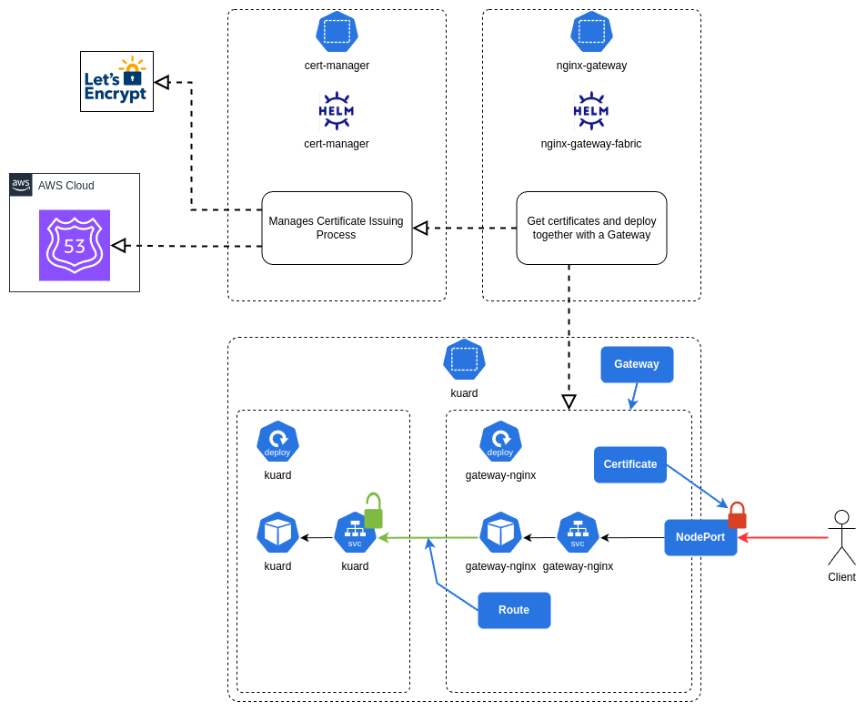

# K3s with Nginx Gateway Fabric with TLS termination via Lets-Encrypt

This recipe was developed and tested early August 2025.

> [!IMPORTANT]
> The intent of this recipe is to get going quickly in a local development environment. For `lets-encrypt`, a staging certificate is used, which means the TLS certificate will not be trusted by a web browser.
>
> The recipe assumes DNS is maintained in AWS Route 53 - adjust the DNS related configuration (including registrar credentials) to suite your needs.

<!-- toc -->

  * [Introduction](#introduction)
- [Preparations](#preparations)
  * [AWS Preparations](#aws-preparations)
  * [Local System Preparations](#local-system-preparations)
- [Uninstall Previous Version](#uninstall-previous-version)
- [Install a Fresh Cluster](#install-a-fresh-cluster)
- [Install the Nginx Gateway Fabric](#install-the-nginx-gateway-fabric)
- [Installing `cert-manager`](#installing-cert-manager)
- [Create a Certificate and add a Gateway](#create-a-certificate-and-add-a-gateway)
  * [Provisioning](#provisioning)
  * [Testing](#testing)
- [References](#references)

<!-- tocstop -->

### Introduction

Basic features covered in this recipe:

* Uninstall a previous deployment
* Install a fresh cluster
* Install the Nginx Gateway Fabric
* Install `cert-manager`
* Configure TLS via `cert-manager` and `lets-encrypt` via AWS Route 53 DNS
* Test Web Server with TLS Gateway and normal unencrypted service (demo application)



> [!IMPORTANT]
> This example does not make use of a Load Balancer. Instead, a `NodePort` is used and therefore every gateway will listen on it's own port.
>
> Furthermore, the example does not cover the use case of certificate rotation, since this is a development use case with an short lifespan (couple of days, perhaps).

## Preparations

### AWS Preparations

For this example, a public hosted zone on AWS must exist. Note down the `ZONE ID`.

In this domain zone, create an `A` record `test1` with the private IP address of your test server, for example `192.168.0.10`.

> [!NOTE]
> You can use any other name besides `test1`, but remember to then also update the manifests files accordingly!

Also create an IAM user with an inline policy attached. The content of the policy is in the file [`route53_policy.json`](./route53_policy.json)

You will need the credentials for the IAM user to update a `Secret` shown later.

### Local System Preparations

Consider using the `kubectl` [power tools](https://github.com/ahmetb/kubectx) for quick context and namespace switching.

Install Helm on the system(s) you wish  to use to interact with the cluster. To check what is currently installed on the cluster, you can then always run the following command:

```bash
helm repo update

# If you have an existing cluster, you can always check all the installed
# packages with the following command:
helm list --all-namespaces
```

Also remove any prior manifests and copy the current template manifests:

```bash
rm -vf /tmp/*.yaml

cp -vf ingress/k3s-nginx-gateway-tls/manifests/* /tmp/
```

Edit the files in `/tmp` to update the fields as indicated in the files.

> [!NOTE]
> From this point, it is assumed that the files in `/tmp` are all properly edited with the correct values.

## Uninstall Previous Version

Only required if you have a current `k3s` cluster. Ideally this experiment should be done on a fresh cluster.

Also refer to the [k3s documentation](https://docs.k3s.io/installation/uninstall) for the most up to date information.

Command:

```bash
/usr/local/bin/k3s-uninstall.sh
```

## Install a Fresh Cluster

> [!NOTE]
> First ensure the previous cluster is uninstalled - see previous section

Commands:

```bash
curl -sfL https://get.k3s.io | INSTALL_K3S_EXEC="server" sh -s - --disable=traefik --kubelet-arg="node-ip=0.0.0.0"

sudo cp -vf /etc/rancher/k3s/k3s.yaml ./k3s.yaml

sudo chown $USER:$USER ~/k3s.yaml
```

On any other system you need the `KUBECONFIG`, run:

```bash
export SERVER=...

scp $SERVER:~/k3s.yaml ~/
```

> [!NOTE]
> Once the `k3s.yaml` is copied, you need to update the IP address of the server in the file

Next, create a testing namespace and install a demo app to test the overall setup:

```bash
kubectl create namespace kuard

kubectl apply -f https://raw.githubusercontent.com/cert-manager/website/master/content/docs/tutorials/acme/example/deployment.yaml -n kuard
# expected output: deployment.extensions "kuard" created

kubectl apply -f https://raw.githubusercontent.com/cert-manager/website/master/content/docs/tutorials/acme/example/service.yaml -n kuard
# expected output: service "kuard" created
```

## Install the Nginx Gateway Fabric

Run the following commands:

```bash
kubectl kustomize "https://github.com/nginx/nginx-gateway-fabric/config/crd/gateway-api/standard?ref=v1.6.2" | kubectl apply -f -

helm install ngf oci://ghcr.io/nginx/charts/nginx-gateway-fabric --create-namespace -n nginx-gateway --set nginx.service.type=NodePort
```

For basic testing, run the following commands:

```bash
# Set the domain 
export DOMAIN=...

cat <<EOF > /tmp/gateway.yaml
apiVersion: gateway.networking.k8s.io/v1
kind: Gateway
metadata:
  name: gateway
spec:
  gatewayClassName: nginx
  listeners:
  - name: http
    port: 80
    protocol: HTTP
    hostname: "*.${DOMAIN}"
EOF

kubectl apply -f /tmp/gateway.yaml -n kuard

# Create the Route:
cat <<EOF > /tmp/routes.yaml
apiVersion: gateway.networking.k8s.io/v1
kind: HTTPRoute
metadata:
  name: kuard
spec:
  parentRefs:
  - name: gateway
    sectionName: http
  hostnames:
  - "test1.${DOMAIN}"
  rules:
  - matches:
    - path:
        type: PathPrefix
        value: /
    backendRefs:
    - name: kuard
      port: 80
EOF

kubectl apply -f /tmp/routes.yaml -n kuard
```

In AWS Route 53, create a record `test1` that points to `192.168.2.13` (IP address of your server on your LAN).

Test connectivity by first getting the `NodePort`:

```bash
kubectl get services -n kuard
NAME            TYPE        CLUSTER-IP     EXTERNAL-IP   PORT(S)        AGE
gateway-nginx   NodePort    10.43.76.175   <none>        80:32223/TCP   5m22s
kuard           ClusterIP   10.43.76.19    <none>        80/TCP         19m
```

In the example output above, the port is 32223. You can then run the following:

```bash
open http://test1.${DOMAIN}:32223/
```

The web page should open in a web browser.

> [!IMPORTANT]
> If the web page is not oening, you will need to troubleshoot this problem first before you can continue.

Post Test Cleanup:

```bash
kubectl delete -f /tmp/routes.yaml -n kuard

kubectl delete -f /tmp/gateway.yaml -n kuard
```

## Installing `cert-manager`

Installing `cert-manager` with `Helm` is well [documented](https://cert-manager.io/docs/installation/helm/), and it comes down to the following command:

```bash
helm install \
  cert-manager oci://quay.io/jetstack/charts/cert-manager \
  --version v1.18.2 \
  --namespace cert-manager \
  --create-namespace \
  --set crds.enabled=true
```

Once the installation is complete, prepare a `ClusterIssuer` for your domain ([general documentation](https://cert-manager.io/docs/configuration/acme/dns01/) and [Route 53 specific documentation](https://cert-manager.io/docs/configuration/acme/dns01/route53/)):

```bash
# Create a secret with the AWS IAM credentials required for updating Route 53
# (lets-encrypt feature for verifying you own the domain)
kubectl apply -f /tmp/01_aws_route53_creds.yaml -n cert-manager

# Deploy the Cluster Issuer 
kubectl apply -f /tmp/02_cluster_issuer.yaml -n cert-manager

# Deploy policy to allow other namespaces access to the required Secrets
kubectl apply -f /tmp/03_cert_read_grant.yaml -n cert-manager
```

## Create a Certificate and add a Gateway

The original application is still deployed, but now we will simply expose the service via TLS (and also still HTTP, for testing purposes).

> [!NOTE]
> Because we issued the certificate from `https://acme-staging-v02.api.letsencrypt.org/directory`, the browser will not trust the certificate.

### Provisioning

The `Gateway` can now be provisioned:

```bash
# Create a certificate
# More info at https://cert-manager.io/docs/usage/certificate/
kubectl apply -f /tmp/04_certificate.yaml -n kuard

# This may take a couple of minutes

# Once the certificate is ready, deploy the Gateway:
kubectl apply -f /tmp/05_gateway.yaml -n kuard

# And finally, add routes to the Gateway to link up with hte application
kubectl apply -f /tmp/06_routes.yaml -n kuard
```

### Testing

Once again, the correct `NodePort` for both HTTP and HTTPS needs to be obtained:

```bash
kubectl get services -n kuard
# Expected Output (example only)
# -----------------------------------------------------------------------------
# NAME            TYPE        CLUSTER-IP     EXTERNAL-IP   PORT(S)                      AGE
# gateway-nginx   NodePort    10.43.196.63   <none>        80:30103/TCP,443:32735/TCP   26h
# kuard           ClusterIP   10.43.76.19    <none>        80/TCP                       32h

# set your application domain:
export APP_DOMAIN="test1.${DOMAIN}"
export HTTP_PORT=$(kubectl get services -n kuard gateway-nginx -o jsonpath='{.spec.ports[?(@.port==80)].nodePort}')
export HTTPS_PORT=$(kubectl get services -n kuard gateway-nginx -o jsonpath='{.spec.ports[?(@.port==443)].nodePort}')

# Test te HTTP port
curl -vvv http://${APP_DOMAIN}:${HTTP_PORT}/

# Test te HTTPS port
# (ignore the certificate check because we are using a staging certificate)
curl -vvv -k https://${APP_DOMAIN}:${HTTPS_PORT}/
```

## References

* [`k3s` Documentation](https://docs.k3s.io/)
* [Nginx Gateway Fabric Documentation](https://docs.nginx.com/nginx-gateway-fabric/)
* [`cert-manager` Documentation](https://cert-manager.io/docs/)
* [Gateway API Specification Documentation](https://gateway-api.sigs.k8s.io/)
